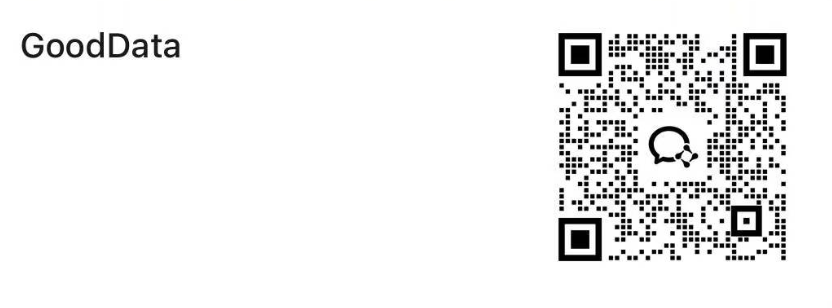

# GoodData
 [接口文档](https://kd6ixqu61g.apifox.cn)  访问密码：123456

**标准的HTTP数据接口**

**随心定制，你的数据需求，值得更好的服务**

## 项目介绍

GoodData是一个专业的社交媒体数据爬虫服务，提供稳定、高效的API接口，帮助开发者快速获取抖音、快手、小红书等平台的数据信息。

## 主要特性

- 🚀 **高性能**: 优化的爬虫算法，确保数据获取的快速和稳定
- 🔒 **安全可靠**: 采用先进的反爬虫技术，保证接口的稳定性和安全性
- 📊 **数据完整**: 提供全面的数据字段，满足各种业务需求
- 🛠️ **易于集成**: 标准的RESTful API设计，支持多种编程语言
- 📈 **实时更新**: 数据实时更新，确保信息的时效性
- 💰 **性价比高**: 合理的定价策略，适合各种规模的企业和个人开发者

## 技术支持

- 📚 **详细文档**: 完整的API文档和示例代码
- 🎯 **专业支持**: 7×24小时技术支持服务
- 🔧 **定制开发**: 根据客户需求提供个性化解决方案
- 📞 **快速响应**: 专业团队快速响应客户需求

## 联系我们——免费试用,专属定制,值得信赖
## 抖音爬虫，小红书爬虫，快手爬虫，tiktok爬虫
- **Telegram**: [t.me/gooddataian](https://t.me/gooddataian)
- **企业微信**
- 

## 我们为你提供的服务

接口详情需要你查看接口文档

### 抖音API(收费10token)

- 获取视频播放数V2（推荐）
- 抖音视频详情
- 获取视频详情v4
- 抖音用户信息
- 抖音用户作品列表

### 快手API(收费10token)

- 快手视频详情
- 快手用户信息
- 快手用户作品列表

### 小红书API(收费50token)

- 小红书笔记详情
- 小红书笔记详情-推荐
- 小红书笔记xsec_token获取
- 小红书用户信息
- 小红书用户作品列表

### 视频号API (联系开发者，申请试用)

- 视频号视频详情
- 视频号用户信息
- 视频号用户作品列表
- 视频号评论

## 常见问题

### Q: 接口调用频率有限制吗？
A: 是的，为了保护服务稳定性，我们对API调用频率有一定限制，具体限制请查看接口文档。

### Q: 支持哪些数据格式？
A: 我们支持JSON格式的数据返回，同时也支持CSV、Excel等格式的数据导出。

### Q: 数据更新频率如何？
A: 数据实时更新，确保信息的时效性和准确性。

### Q: 是否支持批量数据获取？
A: 是的，我们支持批量数据获取，可以大大提高数据获取效率。

## 更新日志

### v1.0.0 (2025-07-11)
- 初始版本发布
- 支持抖音、快手、小红书基础接口
- 提供完整的API文档

---

**选择GoodData，让数据获取变得简单高效！**
​​​​​​​​​​​​​​​​​​​​​​​​​​​​​​​​​​​​​​​​​​​​​​​​​​​​​​​​​​​​​​​​​​​​​​​​​​​​​​​​​​​​​​​​​​​​​​​​​​​​​​​​​​​​​​​​​​​​​​​